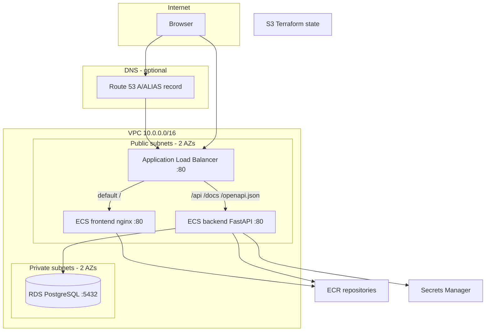

# AWS deployment guide

Step-by-step instructions to deploy the Email CRUD app on AWS, plus how the **Application Load Balancer (ALB)**, **ECS Fargate**, and optional **Route 53** DNS fit together.

For local development, see [README.md](README.md).

---

## Table of contents

1. [Architecture overview](#architecture-overview)
2. [What Terraform creates](#what-terraform-creates)
3. [Prerequisites](#prerequisites)
4. [IAM permissions for terraform apply](#iam-permissions-for-terraform-apply)
5. [Step-by-step deployment](#step-by-step-deployment)
6. [How the ALB is configured](#how-the-alb-is-configured)
7. [How ECS is configured](#how-ecs-is-configured)
8. [Route 53 and custom domains (optional)](#route-53-and-custom-domains-optional)
9. [Request flow (browser → app)](#request-flow-browser--app)
10. [GitHub Actions deploy pipeline](#github-actions-deploy-pipeline)
11. [Verify the deployment](#verify-the-deployment)
12. [Troubleshooting](#troubleshooting)
13. [Tear down](#tear-down)

---

## Architecture overview



**Networking choice:** ECS tasks run in **public subnets** with a public IP (no NAT Gateway). RDS runs in **private subnets** and is reachable only from the ECS security group on port 5432.

**Route 53:** Not created by this repo’s Terraform. You access the app via the ALB DNS name (`email-crud-prod-alb-….elb.amazonaws.com`) unless you add DNS yourself (see [Route 53](#route-53-and-custom-domains-optional)).

---

## What Terraform creates

| Component | Terraform file | Purpose |
|-----------|------------------|---------|
| S3 state bucket | `terraform/bootstrap/` | Remote Terraform state (`use_lockfile`, no DynamoDB) |
| VPC, subnets, IGW | `terraform/deploy/vpc.tf` | Network foundation |
| Security groups | `terraform/deploy/security_groups.tf` | ALB ← internet; ECS ← ALB; RDS ← ECS |
| RDS PostgreSQL | `terraform/deploy/rds.tf` | Managed database in private subnets |
| Secrets Manager | `terraform/deploy/secrets.tf` | DB password (and metadata JSON) |
| ECR | `terraform/deploy/ecr.tf` | Container image registries |
| ECS cluster & services | `terraform/deploy/ecs.tf` | Fargate tasks for backend + frontend |
| ALB & rules | `terraform/deploy/alb.tf` | HTTP routing and health checks |
| IAM / GitHub OIDC | `terraform/deploy/iam.tf` | ECS execution role, CI deploy role |

Default resource naming: `{project_name}-{environment}-*` → e.g. `email-crud-prod-alb`, `email-crud-prod-backend`.

---

## Prerequisites

- [Terraform](https://developer.hashicorp.com/terraform/install) **>= 1.9** (S3 native lockfile)
- [AWS CLI](https://aws.amazon.com/cli/) configured (`aws configure` or SSO)
- A GitHub repository for this project
- Docker (for local builds; CI builds in GitHub Actions)
- An **IAM user or role** with enough permissions to run `terraform apply` (see below)

---

## IAM permissions for `terraform apply`

If you use an IAM user such as `terraform-user` (as in `aws configure`), that identity needs permission to **create** VPC, ALB, ECS, ECR, RDS, Secrets Manager, CloudWatch Logs, and IAM roles (for ECS + GitHub OIDC). Errors like these mean the user is missing rights:

```text
AccessDeniedException: ... is not authorized to perform: ecr:CreateRepository
AccessDeniedException: ... is not authorized to perform: ecs:CreateCluster
AccessDeniedException: ... is not authorized to perform: logs:CreateLogGroup
AccessDeniedException: ... is not authorized to perform: secretsmanager:CreateSecret
```

### Option A — Learning / solo account (simplest)

In **IAM → Users → terraform-user → Add permissions**:

1. Attach managed policy **`AdministratorAccess`**  
   Covers this stack and avoids chasing individual `AccessDenied` errors. Use only on a personal or sandbox account.

### Option B — Custom policy (narrower than admin)

1. Open [`terraform/deploy/terraform-user-iam-policy.json`](terraform/deploy/terraform-user-iam-policy.json).
2. Replace `YOUR_STATE_BUCKET_NAME` with your real state bucket (same as `backend.hcl`).
3. **IAM → Policies → Create policy → JSON** → paste the file → name e.g. `EmailCrudTerraformDeploy`.
4. **IAM → Users → terraform-user → Add permissions → Attach policies** → select `EmailCrudTerraformDeploy`.

You can also attach the same policy to a **group** (e.g. `terraform-operators`) and add `terraform-user` to that group.

### Verify who Terraform is using

```bash
aws sts get-caller-identity
```

---

## Step-by-step deployment

### Step 0 — Clone and configure variables

```bash
git clone <your-repo-url>
cd email-crud-app-fastapi-docker-postgres
```

### Step 1 — Bootstrap Terraform state (S3)

The main stack stores state in S3 with **native lockfile locking** (`use_lockfile = true`). No DynamoDB table.

```bash
cd terraform/bootstrap
cp terraform.tfvars.example terraform.tfvars
```

Edit `terraform.tfvars`:

```hcl
aws_region        = "ap-southeast-5"
state_bucket_name = "<ACCOUNT_ID>-email-crud-terraform-state"  # globally unique
```

Get your account ID:

```bash
aws sts get-caller-identity --query Account --output text
```

Apply bootstrap (uses **local** state in `bootstrap/` only):

```bash
terraform init
terraform plan
terraform apply
```

Create backend config for the main stack:

```bash
cd ../deploy
cp backend.hcl.example backend.hcl
```

Fill `backend.hcl` using bootstrap output:

```bash
cd ../bootstrap && terraform output backend_config_example
```

Example `backend.hcl`:

```hcl
bucket       = "123456789012-email-crud-terraform-state"
key          = "prod/terraform.tfstate"
region       = "us-east-1"
use_lockfile = true
encrypt      = true
```

### Step 2 — Provision AWS infrastructure

```bash
cd ../deploy
cp terraform.tfvars.example terraform.tfvars
```

Edit `terraform.tfvars`:

| Variable | Example | Notes |
|----------|---------|--------|
| `github_repository` | `myuser/email-crud-app-fastapi-docker-postgres` | Must match GitHub `OWNER/NAME` for OIDC |
| `terraform_state_bucket` | Same as `backend.hcl` bucket | CI + IAM S3 access |
| `aws_region` | `us-east-1` | Region for all resources |

Initialize with remote backend:

```bash
terraform init -backend-config=backend.hcl # -upgrade -reconfigure
```

Review and apply:

```bash
terraform plan
terraform apply
```

Save outputs:

```bash
terraform output app_url
terraform output -raw github_actions_role_arn
terraform output alb_dns_name
```

**Expected after first apply:** ECS services may show **unhealthy** or tasks may not start until images exist in ECR (Step 4). That is normal.

### Step 3 — Configure GitHub Actions secrets

Repo → **Settings → Secrets and variables → Actions**:

| Secret | Value |
|--------|--------|
| `AWS_ROLE_ARN` | Output `github_actions_role_arn` |
| `AWS_REGION` | e.g. `ap-southeast-5` |
| `TF_STATE_BUCKET` | Same bucket as `backend.hcl` |

Ensure [`.github/workflows/deploy.yml`](.github/workflows/deploy.yml) `PROJECT_NAME` / `ENVIRONMENT` match Terraform (`email-crud` / `prod` by default).

### Step 4 — Build and deploy container images

Push to `master` or run workflow **Deploy to AWS ECS** manually.

The workflow:

1. Assumes the GitHub OIDC IAM role
2. Builds `backend/` and `frontend/` Docker images
3. Pushes to ECR as `:latest` and `:<git-sha>`
4. Runs `aws ecs update-service --force-new-deployment` on both services

Wait until services stabilize (workflow includes `aws ecs wait services-stable`).

### Step 5 — Open the application

```bash
cd terraform/deploy
terraform output app_url
# e.g. http://email-crud-prod-alb-123456789.us-east-1.elb.amazonaws.com
```

- UI: `/`
- API: `/api/contacts/`
- Docs: `/docs`

### Step 6 (optional) — Custom domain with Route 53

See [Route 53 and custom domains](#route-53-and-custom-domains-optional). Not required for a working deployment.

---

## How the ALB is configured

Defined in [`terraform/deploy/alb.tf`](terraform/deploy/alb.tf).

### Load balancer

| Setting | Value |
|---------|--------|
| Type | Application Load Balancer (layer 7 HTTP) |
| Scheme | Internet-facing (`internal = false`) |
| Subnets | Both **public** subnets (multi-AZ) |
| Security group | `email-crud-prod-alb` — allows inbound **TCP 80** from `0.0.0.0/0` |
| Listener | HTTP **port 80** only (no HTTPS in Terraform yet) |

DNS name format: `{name}-{id}.{region}.elb.amazonaws.com` — use `terraform output alb_dns_name`.

### Target groups

Two target groups, both `target_type = ip` (required for Fargate `awsvpc` mode):

| Target group | Service | Port | Health check path |
|--------------|---------|------|-------------------|
| `email-crud-prod-backend-tg` | FastAPI | 80 | `/api/project/` → expect **200** |
| `email-crud-prod-frontend-tg` | nginx | 80 | `/` → expect **200** |

ECS registers each task’s **private IP** in the target group when the task starts.

### Listener rules (path-based routing)

Traffic hits the HTTP listener on port 80. Rules are evaluated by **priority** (lower number first). First match wins.

| Priority | Path pattern | Forward to |
|----------|--------------|------------|
| *(default)* | everything else | **frontend** target group |
| 10 | `/api`, `/api/*` | **backend** |
| 20 | `/docs`, `/docs/*` | **backend** |
| 30 | `/redoc`, `/redoc/*` | **backend** |
| 40 | `/openapi.json` | **backend** |

**Why this matters for the frontend:** The browser loads the UI from the ALB hostname and calls `/api/...` on the **same origin**. [`frontend/js/app.js`](frontend/js/app.js) uses `window.location.origin` in production (not `:8000`), so ALB path routing must send `/api/*` to the backend.

Example:

```text
GET http://<alb-dns>/              → nginx (static HTML/CSS/JS)
GET http://<alb-dns>/api/contacts/ → FastAPI
GET http://<alb-dns>/docs            → FastAPI OpenAPI UI
```

### Security path

```text
Internet → ALB (alb SG) → ECS tasks (ecs SG, only from alb SG on port 80)
```

ECS tasks are **not** exposed directly to the internet; only the ALB is.

---

## How ECS is configured

Defined in [`terraform/deploy/ecs.tf`](terraform/deploy/ecs.tf), [`terraform/deploy/ecr.tf`](terraform/deploy/ecr.tf), [`terraform/deploy/iam.tf`](terraform/deploy/iam.tf).

### Cluster

- One cluster: `email-crud-prod-cluster`
- Launch type: **FARGATE** (no EC2 capacity providers)

### Two separate services

| Service | Task definition | Image source | Container port |
|---------|-----------------|--------------|----------------|
| `email-crud-prod-backend` | `email-crud-prod-backend` | ECR `…-backend:latest` | 80 |
| `email-crud-prod-frontend` | `email-crud-prod-frontend` | ECR `…-frontend:latest` | 80 |

Each service has `desired_count = 1` by default (configurable via `desired_count` in `variables.tf`).

### Task networking (`awsvpc`)

| Setting | Value |
|---------|--------|
| `network_mode` | `awsvpc` — each task gets its own ENI / IP |
| Subnets | **Public** subnets in two AZs |
| `assign_public_ip` | `true` — outbound internet for ECR image pull, CloudWatch logs |
| Security group | `email-crud-prod-ecs` — inbound **80/tcp only from ALB SG** |

**No NAT Gateway:** Public IP on tasks avoids NAT cost; RDS stays private.

### Load balancer attachment

Each service registers its task with one target group:

```hcl
load_balancer {
  target_group_arn = aws_lb_target_group.backend.arn
  container_name   = "backend"
  container_port   = 80
}
```

ECS keeps target group registration in sync when tasks start/stop during deployments.

### Backend task environment

| Source | Variables |
|--------|-----------|
| Plain env | `POSTGRES_HOST` (RDS address), `POSTGRES_PORT`, `POSTGRES_USER`, `POSTGRES_DB`, `PROJECT_*` |
| Secrets Manager | `POSTGRES_PASSWORD` from secret key `password` |

On startup, FastAPI runs `create_all()` for SQLAlchemy models ([`backend/services.py`](backend/services.py)). The container runs [`wait-for-postgres.sh`](backend/wait-for-postgres.sh) against `POSTGRES_HOST` before uvicorn starts.

### Frontend task

- nginx serves static files from the image ([`frontend/Dockerfile`](frontend/Dockerfile))
- Container health check: `wget` against `http://localhost:80/`

### IAM roles

| Role | Used by | Purpose |
|------|---------|---------|
| **Execution role** | Fargate agent | Pull ECR image, write CloudWatch logs, read Secrets Manager |
| **Task role** | Application | Minimal (no extra AWS API calls from app code today) |
| **GitHub Actions role** | CI OIDC | Push ECR, `ecs:UpdateService`, S3 state access for Terraform plan |

### Task definition updates from CI

Both services use:

```hcl
lifecycle {
  ignore_changes = [task_definition]
}
```

Terraform defines the initial task definition; **GitHub Actions** deploys new images by pushing `:latest` to ECR and forcing a new deployment. The running task definition still references `:latest`, so ECS pulls the new image on redeploy.

### Logs

- `/ecs/email-crud-prod-backend`
- `/ecs/email-crud-prod-frontend`

Retention: 14 days.

---

## Route 53 and custom domains (optional)

**This repository does not create Route 53 records or ACM certificates.** Access is via the ALB DNS name from Terraform.

To use your own domain (e.g. `contacts.example.com`):

### 1. Register or use a hosted zone

- Route 53 hosted zone for your domain, **or**
- DNS at another registrar (point records to AWS)

### 2. Request an ACM certificate (HTTPS)

In **us-east-1** (same region as ALB) if using CloudFront later; for ALB-only, certificate must be in the **same region as the ALB**.

- Domain: `contacts.example.com` (and optionally `*.example.com`)
- Validation: DNS (Route 53 makes this easy)

### 3. Add HTTPS to the ALB (manual or extend Terraform)

Today only **HTTP :80** exists. For production you typically:

1. Add an HTTPS listener on **443** with the ACM certificate
2. Optionally redirect HTTP → HTTPS
3. Update ALB security group to allow 443

This is a common follow-up Terraform change (not included yet).

### 4. Create a Route 53 alias record

| Field | Value |
|-------|--------|
| Record name | `contacts` (or subdomain you want) |
| Type | **A** |
| Alias | Yes |
| Target | Application Load Balancer → select your `email-crud-prod-alb` |
| Evaluate target health | Yes (recommended) |

Route 53 returns the ALB’s IPs as an alias; when the ALB is replaced, AWS updates targets automatically.

### 5. Verify

```bash
dig contacts.example.com
curl -I http://contacts.example.com/api/project/
```

Until HTTPS is configured, use `http://` or terminate TLS at the ALB.

---

## Request flow (browser → app)

**Load the contacts page**

```text
1. Browser GET http://<alb-dns>/
2. ALB default rule → frontend target group
3. nginx serves index.html, css/, js/
4. app.js sets API_BASE = window.location.origin
5. Browser GET http://<alb-dns>/api/project/  (metadata)
6. ALB rule priority 10 → backend target group
7. FastAPI returns JSON; UI renders title/version
8. Browser GET http://<alb-dns>/api/contacts/
9. FastAPI queries RDS → returns contact list
```

**Create a contact**

```text
POST http://<alb-dns>/api/contacts/  → ALB → backend → RDS INSERT
```

**Database path**

```text
backend task (public subnet, private IP)
  → RDS endpoint (private subnet, port 5432, ecs SG only)
```

---

## GitHub Actions deploy pipeline

| Workflow | File | When | What it does |
|----------|------|------|----------------|
| Deploy to AWS ECS | [`.github/workflows/deploy.yml`](.github/workflows/deploy.yml) | Push to `master`, manual | Build/push images, force ECS rollout |
| Terraform | [`.github/workflows/terraform.yml`](.github/workflows/terraform.yml) | PR touching `terraform/` | `fmt`, `validate`, optional `plan` with S3 backend |

OIDC trust is scoped to `repo:<github_repository>:*` (see [`terraform/deploy/iam.tf`](terraform/deploy/iam.tf)).

Infrastructure **apply** remains manual (`terraform apply` locally) to avoid accidental destroys from CI.

---

## Verify the deployment

```bash
# ALB URL
terraform -chdir=terraform/deploy output app_url

# ECS services running
aws ecs describe-services \
  --cluster email-crud-prod-cluster \
  --services email-crud-prod-backend email-crud-prod-frontend \
  --query 'services[*].{name:serviceName,running:runningCount,desired:desiredCount}'

# Target health
aws elbv2 describe-target-health \
  --target-group-arn $(aws elbv2 describe-target-groups \
    --names email-crud-prod-backend-tg --query 'TargetGroups[0].TargetGroupArn' --output text)

# API smoke test
curl -s "$(terraform -chdir=terraform/deploy output -raw app_url)/api/project/" | jq .
```

In the AWS Console:

- **ECS** → cluster → both services → running tasks
- **EC2** → Load Balancers → target groups → healthy targets
- **RDS** → instance available

---

## Troubleshooting

| Symptom | Likely cause | What to check |
|---------|----------------|---------------|
| ECS tasks not starting | No image in ECR yet | Run deploy workflow; verify ECR has `latest` tag |
| Target group unhealthy | App not listening on 80 or wrong health path | CloudWatch logs; `curl` task IP from debug (tasks in public subnet) |
| `503` from ALB | No healthy targets | ECS events tab; backend DB connection / `wait-for-postgres` |
| API works locally on `:8000` but not on ALB | Frontend still pointing at `:8000` | Confirm [`app.js`](frontend/js/app.js) uses same origin when port ≠ 8080 |
| Terraform state lock error | Concurrent apply or stale lock | S3 bucket: delete `.tflock` object if no other apply is running |
| GitHub Actions auth failed | Wrong `AWS_ROLE_ARN` or repo mismatch | `github_repository` in tfvars must match `OWNER/NAME` |

---

## Tear down

**Application stack** (ECS, ALB, RDS, etc.):

```bash
cd terraform/deploy
terraform destroy
```

If ECR images block deletion, empty repositories first in the console or CLI.

**Remote state bucket** (only when you no longer need state):

```bash
cd terraform/bootstrap
# Remove prevent_destroy from main.tf if you added it, or empty bucket first
terraform destroy
```

**Route 53:** Delete any manual records you created; hosted zones with registered domains may incur charges until removed.

---

## Related files

- [README.md](README.md) — quick start and local Docker Compose
- [terraform/bootstrap/](terraform/bootstrap/) — S3 state bucket (one-time)
- [terraform/deploy/](terraform/deploy/) — application infrastructure (ECS, ALB, RDS, …)
- [.github/workflows/deploy.yml](.github/workflows/deploy.yml) — image build and ECS rollout
