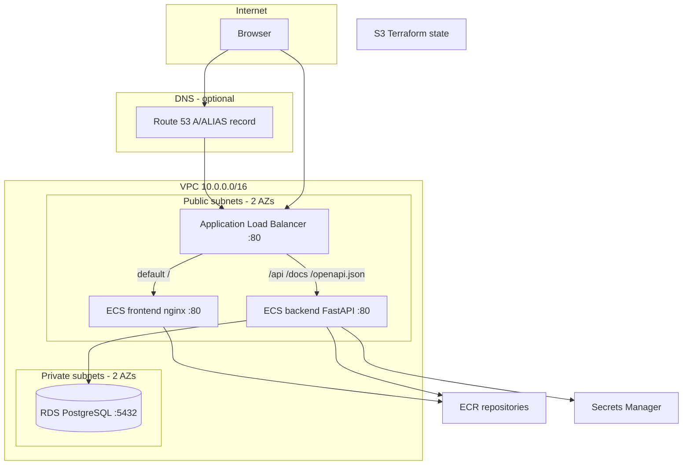

This is a simple CRUD app for storing emails. We're using FastAPI, Docker, Postgres, and a plain HTML/CSS/JS frontend. **Mainly built to practice AWS & Terraform!**


# 1.0 Starting the application

Make sure you've got Docker installed on your system!

```bash
docker compose up --build
```

- **Frontend (UI):** http://localhost:8080
- **Backend (API):** http://localhost:8000 — docs at `/docs`, project metadata at `/api/project/`

Copy `.env.sample` to `.env` and set `PROJECT_TITLE`, `PROJECT_VERSION`, and `PROJECT_DESCRIPTION`; the UI loads these from the API.

# 2.0 Deployment on AWS

**Full step-by-step guide:** [DEPLOYMENT.md](DEPLOYMENT.md) (bootstrap, Terraform, ALB/ECS/Route 53 behavior, troubleshooting).

Infrastructure: **ECS Fargate** (public subnets, no NAT) + **RDS PostgreSQL** (private) + **ALB** path routing + **ECR** + **Secrets Manager**. CI pushes images via **GitHub Actions OIDC**.

## Architecture overview



## Quick deploy summary

See **[DEPLOYMENT.md](DEPLOYMENT.md)** for the complete guide. Short version:

1. Bootstrap S3 state → `terraform/bootstrap`
2. `cd terraform/deploy` → `terraform init -backend-config=backend.hcl` → `terraform apply`
3. Set GitHub secrets (`AWS_ROLE_ARN`, `AWS_REGION`, `TF_STATE_BUCKET`)
4. Push to `master` or run **Deploy to AWS ECS**
5. Open `terraform output app_url` (from `terraform/deploy`)

## Prerequisites

1. [Terraform](https://developer.hashicorp.com/terraform/install) >= 1.9 (required for S3 native state locking via `use_lockfile`)
2. [AWS CLI](https://aws.amazon.com/cli/) configured (`aws configure`)
3. GitHub repository for this project

## Local vs AWS configuration

| Variable | Local (Compose) | AWS (ECS) |
|----------|-----------------|-----------|
| `POSTGRES_HOST` | `postgres` | RDS endpoint (set by Terraform) |
| `POSTGRES_PASSWORD` | `.env` | Secrets Manager |
| API URL (browser) | `:8000` from `:8080` UI | Same origin via ALB |

## Terraform CI

On pull requests that touch `terraform/`, the **Terraform** workflow runs `fmt`, `validate`, and optionally `plan` when `AWS_ROLE_ARN`, `AWS_REGION`, and `TF_STATE_BUCKET` secrets are set.

Infrastructure apply is **manual** (`terraform apply` locally) to avoid accidental destroys from CI.

## Tear down

```bash
cd terraform/deploy
terraform destroy
```

Empty ECR repositories first if destroy fails on images still in use.

The state bucket in `terraform/bootstrap/` is separate; destroy it only when you no longer need remote state (`cd terraform/bootstrap && terraform destroy`).

# 3.0 Resources
- [Complete Guide to Creating and Pushing Docker Images to Amazon ECR](https://medium.com/@sayalishewale12/complete-guide-to-creating-and-pushing-docker-images-to-amazon-ecr-70b67ac1ab4c#:~:text=Go%20back%20to%20the%20AWS,south%2D1.amazonaws.com)
- [FastAPI Alternative Events (deprecated)](https://fastapi.tiangolo.com/advanced/events/#alternative-events-deprecated)
- [Docker Tutorial for Beginners [FULL COURSE in 3 Hours]](https://www.youtube.com/watch?v=3c-iBn73dDE)
- [FastAPI with PostgreSQL and Docker](https://www.youtube.com/watch?v=2X8B_X2c27Q)
- [How to Setup AWS ECS Fargate with a Load Balancer | Step by Step](https://www.youtube.com/watch?v=o7s-eigrMAI)
- Resources used for debugging:
    - https://stackoverflow.com/questions/45211594/running-a-custom-script-using-entrypoint-in-docker-compose
    - https://stackoverflow.com/questions/74390647/postgres-airflow-db-permission-denied-for-schema-public
    - https://stackoverflow.com/questions/60138692/sqlalchemy-psycopg2-errors-insufficientprivilege-permission-denied-for-relation#comment130285399_69322902